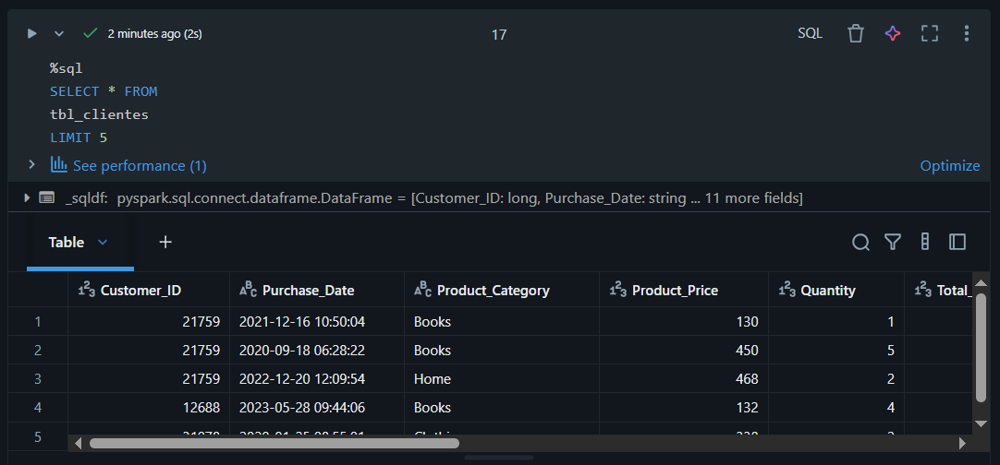
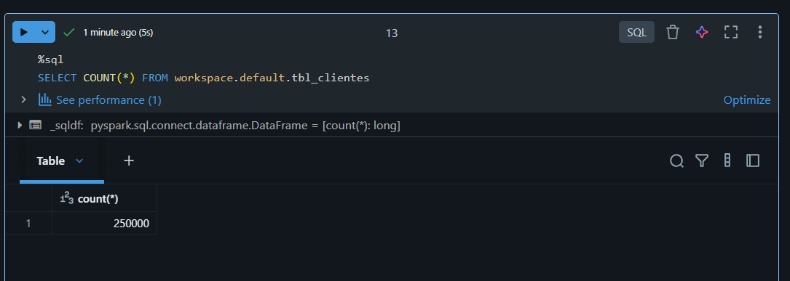
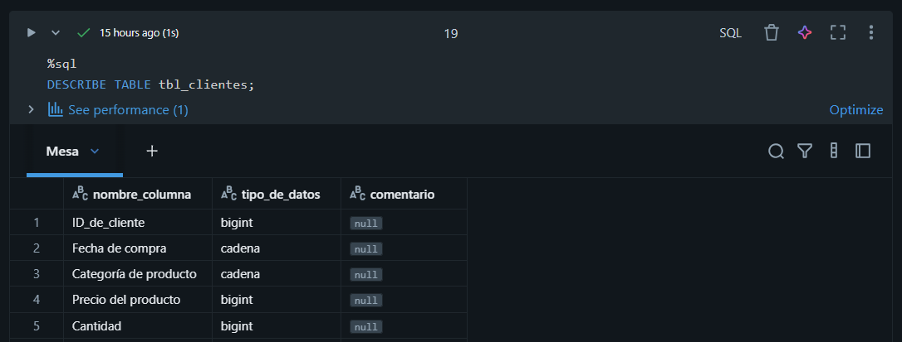
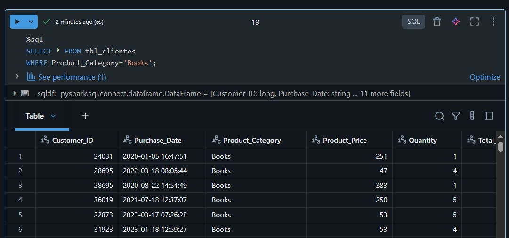

# Unidad 1. Evidencia de Aprendizaje 1 - Creación de una base de datos analítica

**Autores**

*Tatiana Orozco Alzate*

**Materia:** *Big Data*

**Tutor:** *Andres Felipe Callejas*

**Institución:** *Institución Universitaria Digital de Antioquia*

---

## 🚀 Problema

La necesidad real de este análisis radica en que la empresa de e-commerce, simulada por el dataset, requiere reducir el coste de adquisición de clientes mediante la implementación de una estrategia de retención proactiva. El trabajo está dirigido al Equipo de Marketing y Fidelización, proporcionando una herramienta predictiva para intervenir solo en clientes en riesgo. Este problema requiere analítica avanzada porque el volumen de datos (comportamiento, compras, devoluciones) es demasiado complejo para el análisis manual. Se necesita modelos de clasificación que predigan el Churn y técnicas de segmentación que definan grupos de clientes para optimizar los esfuerzos y el presupuesto de retención.

---

## 📦 Dataset

**Fuente:** https://www.kaggle.com/datasets/shriyashjagtap/e-commerce-customer-for-behavior-analysis

---

## 📋 Variables Relevantes y Su Utilidad

El análisis se centra en las siguientes variables clave del dataset, elegidas por su impacto potencial en el comportamiento de abandono.

- **Churn (Binario):** Entrena el modelo para clasificar a los clientes como activos o inactivos.

- **Purchase_Date (Temporal):** Se utiliza para calcular hace cuanto tiempo compró el cliente.

- **Customer_ID (Numerico):** Permite agrupar las transacciones y medir la frecuencia de cada cliente.

- **Total_Purchase_Amount (Numerico):** Usada para calcular el gasto total. Permite priorizar a los clientes de alto valor para la retención..

---

## 🏗️ Diseño del Modelo Entidad-Relación (ERD)

La tabla CLIENTE almacena los datos personales y el indicador de abandono (Churn). La tabla TRANSACCION registra cada compra individual. Ambas tablas están conectadas por el Customer_ID en una relación de UNO a MUCHOS (1:N), lo que permite asociar todas las compras a un cliente específico para el análisis de comportamiento.

---

## 🛠️ Creación Base de Datos e Insertar Información

- **Carga con un SELECT * LIMIT 5**

## 💾 Carga y Validación de Datos en Databricks SQL

- **Conteo de registros:**

Esta consulta devuelve un único número. Este valor representa la cantidad total de clientes únicos que existen en la tabla. Es la primera verificación de integridad de datos y confirma cuántas filas de cliente procesará el modelo de predicción de abandono (Churn).

- **Nombres y tipo de comumnas - Databricks**

Esta información es crucial para verificar que los tipos de datos se cargaron correctamente y que el proceso de ingeniería de características podrá funcionar sin errores de casting.

- **Consulta con filtro**

El resultado muestra una pequeña submuestra de los clientes que la empresa ha perdido o que han abandonado la plataforma. Esto permite a los analistas inspeccionar rápidamente las características de estos clientes (edad, género, etc.) antes de la etapa de modelado predictivo para buscar patrones iniciales.

